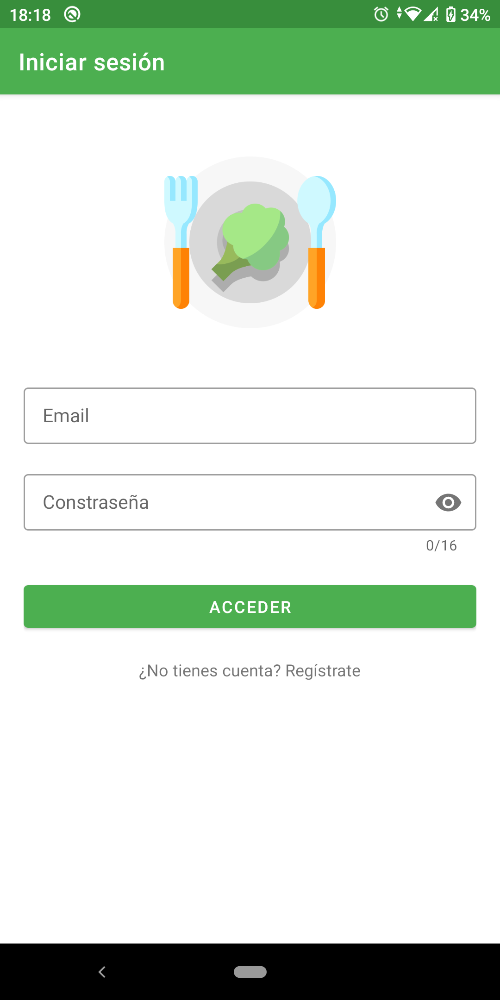
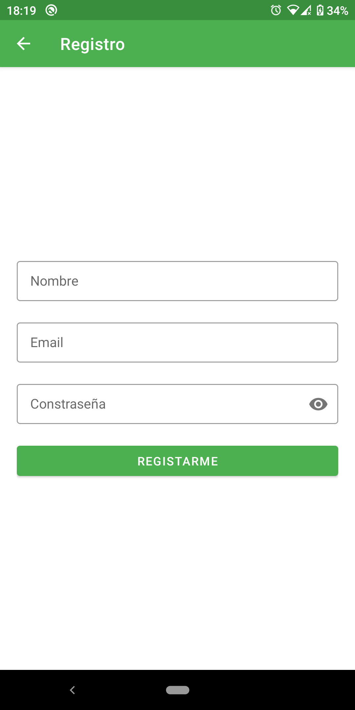
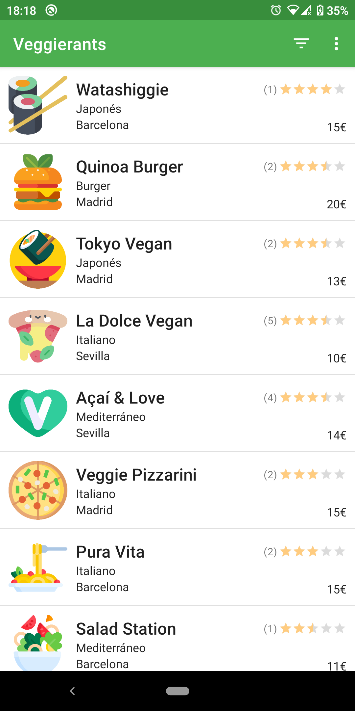
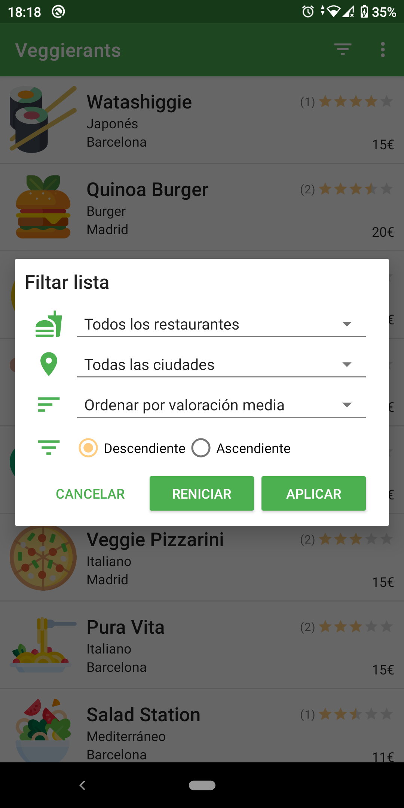
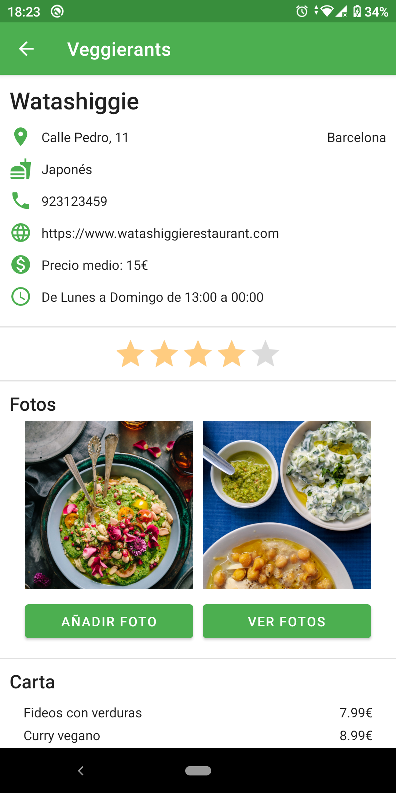
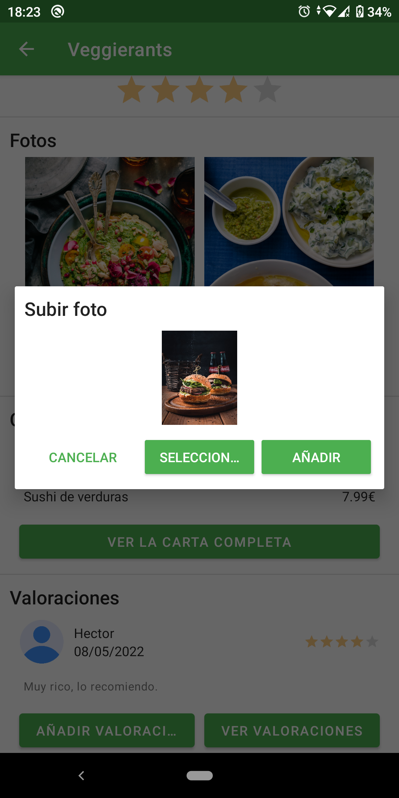
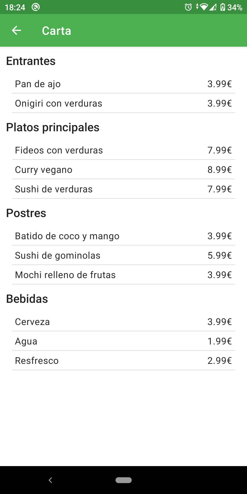
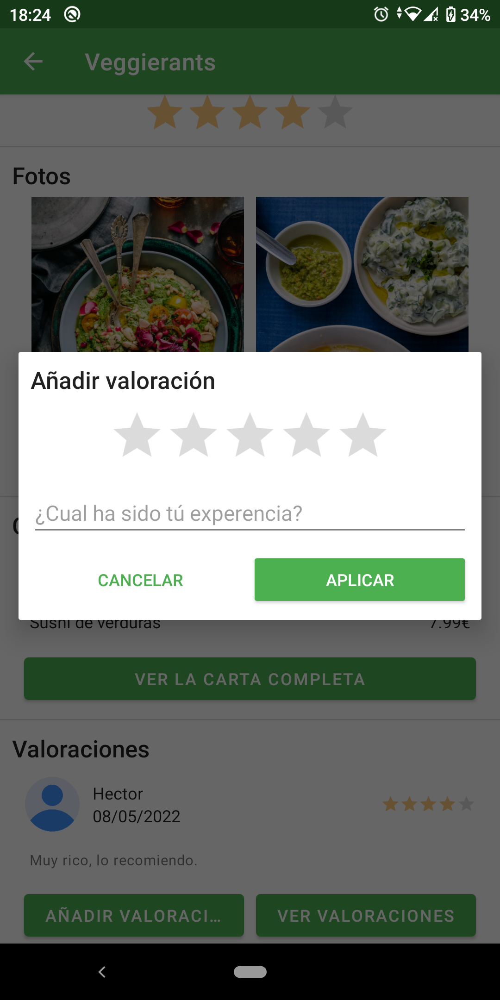

# Veggierants
###### Android App where the users can view vegan restaurants by filtering by their criteria and can also rate and comment on the restaurant. You can see the average rating of all the ratings and all the comments from other users. This is my final thesis.
## Screenshots
         
## Tools
- Kotlin
- Glide
- Firebase
   - Firebase Authentication
   - Firebase Firestore
   - Firebase Storage
- Flaticon
